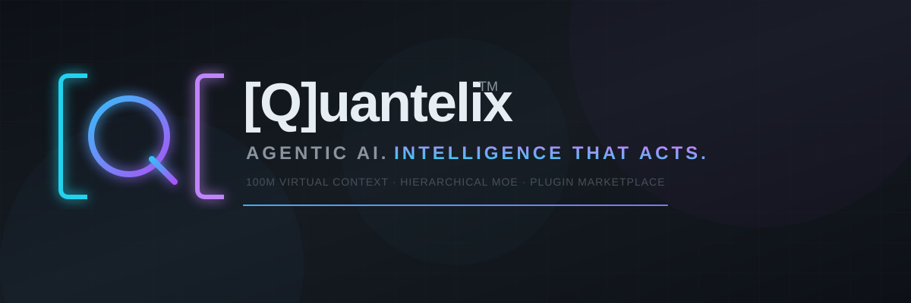
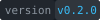
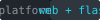
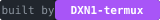

<p align="center">
  
</p>

<p align="center">
  <a href="LICENSE">
    
  </a>
  <a href="#">
    
  </a>
  <a href="#">
    
  </a>
  <a href="#">
    
  </a>
  <a href="https://github.com/DXN1-termux">
    
  </a>
</p>

<p align="center">
  <a href="#core-engine">Core Engine</a> •
  <a href="#context-engine">100M Context</a> •
  <a href="#memory-system">Memory</a> •
  <a href="#moe-system">MoE Agents</a> •
  <a href="#tools">Tools</a> •
  <a href="#workflows">Workflows</a> •
  <a href="#marketplace">Marketplace</a> •
  <a href="#enterprise">Enterprise</a> •
  <a href="#quick-start">Quick Start</a>
</p>

---

[Q]uantelix is a fully autonomous agentic AI platform built from the ground up by **[DXN1-termux](https://github.com/DXN1-termux/)**. It features a custom agent orchestration engine with hierarchical Mixture-of-Experts, a **100M token virtual context window** with intelligent retrieval, a biological-inspired memory system with decay and merging, a visual workflow builder, a plugin marketplace, and enterprise-grade security — all wrapped in a premium web interface.

---

## Core Engine

| Component | Description | Lines |
|-----------|-------------|-------|
| `Orchestrator` | Main agent loop: plan, execute, evaluate, respond | 120 |
| `ContextManager` | 100M virtual context with multi-tier compression | 130 |
| `Planner` | ReAct-style planning with structured tool calls | 60 |
| `Executor` | Sandboxed tool execution with timeouts | 80 |
| `EventBus` | Real-time pub/sub for UI state visualization | 50 |
| `MemorySystem` | Biological-inspired memory with graph | 200+ |

## Context Engine

The context engine bridges a **100M token virtual window** with actual LLM context windows (128K–1M depending on model). Every message, tool output, and document is stored in a persistent SQLite store and smartly retrieved via a **6-dimension sort engine**.

### Sort Dimensions

| Dimension | Weight | What it measures |
|-----------|--------|-----------------|
| Relevance | 0.30 | Query similarity (keyword overlap) |
| Recency | 0.20 | Exponential decay with configurable half-life |
| Importance | 0.25 | Content significance (decisions, errors, code) |
| Frequency | 0.10 | How often recalled or referenced |
| Type Weight | 0.10 | Code snippets, instructions, casual |
| Emotional Signal | 0.05 | Urgency markers, errors, breakthroughs |

### Tier Allocation

```
┌──────────────────────────────────────────────┐
│  SQLite Store (100M tokens)                    │
│  ┌────────┐ ┌────────┐ ┌────────┐ ┌────────┐ │
│  │  Hot   │ │  Warm  │ │  Cool  │ │  Cold  │ │
│  │ raw    │ │ comp-  │ │ summa- │ │ arch-  │ │
│  │ msgs   │ │ ressed │ │ rized  │ │ ived   │ │
│  └────────┘ └────────┘ └────────┘ └────────┘ │
└──────────────────┬───────────────────────────┘
                   │
                   ▼
┌──────────────────────────────────────────────┐
│  Sort Engine (filter → score → rank → select) │
└──────────────────┬───────────────────────────┘
                   │
                   ▼
┌──────────────────────────────────────────────┐
│  LLM Context Window (128K–1M)                 │
│  System 5% | Retrieved 40% | Recent 25%       │
│  | Working 20% | Reserve 10%                  │
└──────────────────────────────────────────────┘
```

## Memory System

Biological-inspired memory with four types and automatic lifecycle management.

### Memory Types

| Type | What it stores | Decay | Example |
|------|---------------|-------|---------|
| **Episodic** | Events, conversations | 0.95/day | User asked about Docker at 3pm |
| **Semantic** | Facts, knowledge | 0.99/week | User prefers TypeScript |
| **Procedural** | How-to, workflows | 0.999/month | Deploy command: vercel --prod |
| **Working** | Current task context | 0.8/hour | Editing file X to fix bug Y |

### Lifecycle

```
Create → Encode → Store → Recall (strengthen) → Decay → Archive
                              ↓
                         Merge (similar memories combine)
                              ↓
                         Graph (temporal + causal links)
```

## MoE System

Hierarchical Mixture-of-Experts with **8 specialized agents** coordinated by a central router.

```
User Request
    │
    ▼
┌──────────────────────────────────────┐
│         MoE Router                    │
│  Task analysis → keyword detection    │
│  → route to primary + supporting      │
└──────┬──────────┬──────────┬─────────┘
       │          │          │
       ▼          ▼          ▼
┌─────────┐ ┌─────────┐ ┌─────────┐
│ Planner  │ │  Coder  │ │Researcher│  ← Expert Agents
│ Agent    │ │  Agent  │ │ Agent    │
├─────────┤ ├─────────┤ ├─────────┤
│ Decom-  │ │ Write   │ │ Search   │
│ pose    │ │ Debug   │ │ Research │
│ Route   │ │ Refactor│ │ Analyze  │
└─────────┘ └─────────┘ └─────────┘
```

### Expert Agents

| Expert | Model | Tools | Max Sub-Agents |
|--------|-------|-------|---------------|
| **Planner** | GPT-4o | Planning, routing, context | 5 |
| **Coder** | GPT-4o | File ops, git, commands | 20 |
| **Researcher** | GPT-4o-mini | Web search, fetch, read | 10 |
| **DevOps** | GPT-4o-mini | Docker, deploy, network | 15 |
| **Data** | GPT-4o-mini | SQLite, JSON, CSV | 10 |
| **Tester** | GPT-4o-mini | Test, lint, benchmark | 10 |
| **Writer** | GPT-4o-mini | Docs, README, changelogs | 5 |
| **Reviewer** | GPT-4o | Code review, audit | 5 |

Each expert can spawn **sub-agents** — lightweight agents per sub-task that execute independently and report back. Sub-agents share context via a **Memory Bus** (pub/sub communication channel).

---

## Tools

### Built-in (20+ Tools)

<p>
  <code>read_file</code> <code>write_file</code> <code>edit_file</code> <code>search_code</code> <code>list_directory</code><br>
  <code>execute_command</code> <code>execute_script</code><br>
  <code>git_status</code> <code>git_diff</code> <code>git_log</code> <code>git_commit</code> <code>git_branch</code> <code>git_checkout</code> <code>git_push</code><br>
  <code>web_search</code> <code>read_url</code><br>
  <code>remember</code> <code>recall</code> <code>forget</code><br>
  <code>check_port</code> <code>find_open_port</code><br>
  <code>docker_ps</code> <code>docker_exec</code> <code>docker_compose_up</code> <code>docker_build</code><br>
  <code>deploy_vercel</code> <code>deploy_netlify</code><br>
  <code>query_sqlite</code> <code>list_tables</code> <code>create_table</code><br>
  <code>http_request</code> <code>graphql_query</code> <code>test_endpoint</code>
</p>

### Plugin Marketplace

| Feature | Description |
|---------|-------------|
| **Registry** | Central catalog of community plugins |
| **Sandbox** | Isolated runtime with declared permissions |
| **Verifier** | Plugin security scanning before install |
| **MCP Bridge** | Connect to external MCP servers |

Featured plugins: Supabase Client, Stripe API, AWS S3, Slack Messenger, Kubernetes CLI, GitHub Actions, Sentry Debugger, Figma Export, and more.

---

## Workflows

Visual drag-and-drop workflow builder with **9 node types**:

| Node | Function |
|------|----------|
| Start / End | Workflow entry and exit |
| Action | Execute a tool |
| Sub-Agent | Spawn an expert agent |
| Condition | If/else branching |
| Loop | Iterate over data |
| Human Input | Pause for user approval |
| Parallel | Run steps concurrently |
| Merge | Combine parallel results |

Workflows can be **scheduled** (hourly/daily/weekly via cron) or **triggered** by events (git push, webhook, timer).

---

## Enterprise

| Feature | Description |
|---------|-------------|
| **SSO / SAML** | Okta, Azure AD, Google Workspace |
| **RBAC** | Admin, Developer, Viewer roles |
| **Audit Log** | Full action trail with severity filtering and export |
| **Policy Engine** | Allow/block/rate-limit/approval rules per tool |
| **Data Residency** | US, EU, or APAC region selection |
| **Admin Panel** | User management, billing, usage analytics |

---

## Quick Start

### Web App (Node.js)

```bash
# Clone
git clone https://github.com/DXN1-termux/-Q-uantelix.git
cd -Q-uantelix

# Install and run
cd web && npm install && npm run dev
```

Opens at `http://localhost:3000`

### Flask Backend (Python / Termux)

```bash
pip install flask flask-cors
python server/app.py
```

Auto-finds an available port (3000–8099).

### Port Checker

```bash
python scripts/port-check.py --find
```

---

## Architecture

```
-Q-uantelix/
├── agent/             # Custom agent runtime (TypeScript)
│   ├── core/          # Orchestrator, context, memory, sort engine
│   ├── moe/           # MoE router, experts, sub-agents, coordinator
│   ├── workflow/      # Workflow interpreter + scheduler
│   ├── knowledge/     # RAG system, chunking, retrieval
│   ├── tools/         # 20+ built-in tool implementations
│   ├── plugins/       # Plugin registry, marketplace, MCP bridge
│   ├── providers/     # OpenAI, Anthropic LLM providers
│   ├── sandbox/       # Docker container management
│   └── enterprise/    # Audit logger, policy engine
├── web/               # Next.js web app (React, Tailwind, shadcn)
│   ├── src/components/#
│   │   ├── brand/     # Custom SVG illustrations, logos
│   │   ├── chat/      # Chat panel, messages, context indicator
│   │   ├── workflow/  # Workflow canvas, palette, nodes
│   │   ├── marketplace/# Plugin browse, install, manage
│   │   ├── knowledge/ # Knowledge source management
│   │   ├── collab/    # Live cursors, presence
│   │   └── admin/     # Enterprise admin panel
│   └── src/lib/       # Zustand store, hooks
├── server/            # Flask + WebSocket backends
├── assets/            # Brand SVGs, shields, illustrations
│   ├── banners/       # README banner graphics
│   ├── shields/       # Badge SVGs (license, version, etc.)
│   └── ui/            # Empty, loading, error states
├── infrastructure/    # Docker, K8s, Terraform
├── scripts/           # Port checker, dev server, start script
└── docs/              # Architecture, tools API, contributing
```

---

## Tech Stack

| Layer | Technology |
|-------|-----------|
| Frontend | Next.js 16, React 19, TypeScript, Tailwind CSS v4 |
| UI Components | shadcn/ui (22 components) |
| Code Editor | Monaco Editor |
| Terminal | xterm.js |
| State Management | Zustand |
| Agent Engine | Custom TypeScript (zero frameworks) |
| Database | SQLite (via child_process) |
| LLM Providers | OpenAI API, Anthropic API |
| Backend | Python Flask with CORS |
| Real-time | WebSocket (Node.js) |
| Containerization | Docker, Docker Compose |
| Orchestration | Kubernetes (Helm chart) |
| Infra as Code | Terraform (AWS) |
| Payments | Stripe |

---

## Brand

| Element | Detail |
|---------|--------|
| **Name** | `[Q]uantelix` — Q in brackets is the logo icon |
| **Tagline** | `AGENTIC AI. INTELLIGENCE THAT ACTS.` |
| **Colors** | Dark `#0d1117`, Cyan `#38bdf8` / `#22d3ee`, Purple `#a855f7` / `#c084fc` |
| **Logo** | Custom SVG with cyan/purple gradient bracket icon and magnifying circle |
| **Design** | Dark-first, glassmorphism panels, gradient accents, minimal chrome |

<p align="center">
  
</p>

---

## License

Proprietary — see [LICENSE](./License).

---

<p align="center">
  
  <br>
  <sub>Built by <a href="https://github.com/DXN1-termux">DXN1-termux</a></sub>
</p>
